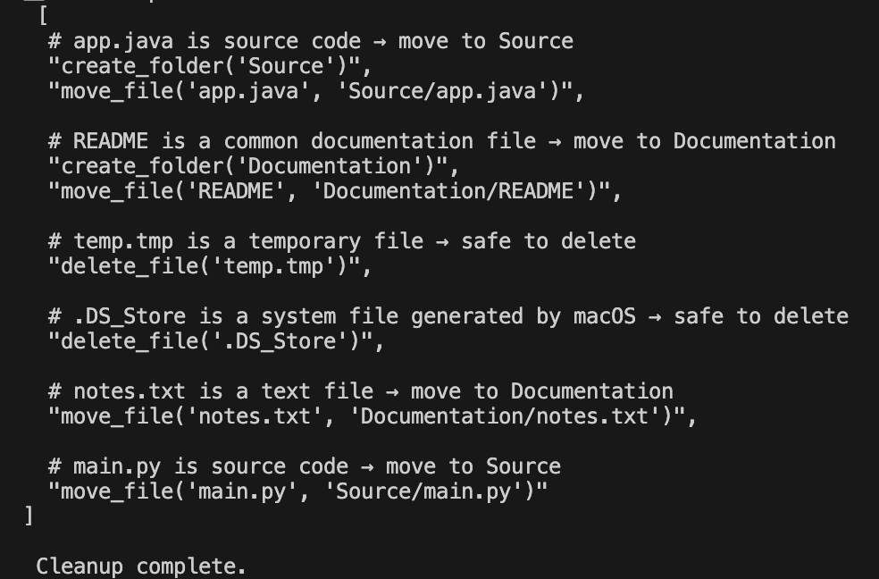
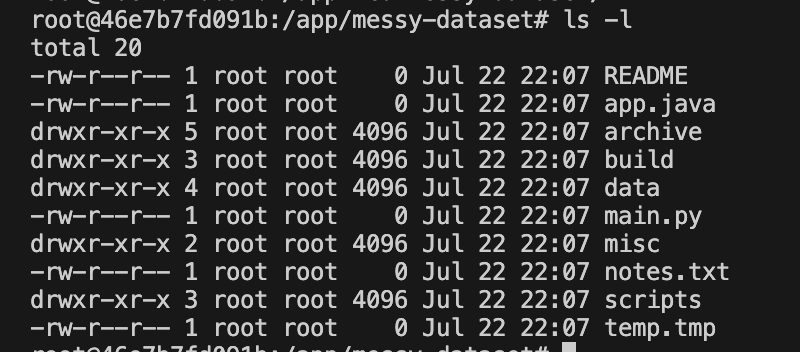
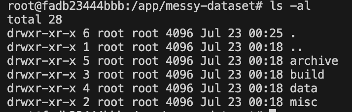

[This](https://akhilvreddy.com/posts/agentic-framework/) is the original blog post that I wrote. [This](https://huggingface.co/datasets/akhilvreddy/simple-linux-containerized-dataset) is the test dataset I am using. I hosted the dataset on hugging face and have more information about what's in it there.

---

# File Cleanup Agent

An autonomous agent that organizes a messy Linux-style file system using real system calls, reasoning via GPT-4, and a memory-driven planning loop containerized in Docker.

---

## What this does

What It Does

- Scans an unstructured file system (like `Downloads/`)
- Uses GPT-4 to reason about what files are, where they should go, and what to delete
- Takes real actions like `mv`, `mkdir`, and `rm`
- Has memory, reflexion, and a dry-run safety mode
- Runs inside a Docker container as a self-contained agent

---

## Example output

Here's what the original "dataset" looked like (you'll see this exact thing on hugging face)

```txt
messy-dataset/
├── main.py
├── app.java
├── README
├── .DS_Store
├── notes.txt
├── temp.tmp
├── build/
│   ├── debug.log
│   ├── app.class
│   ├── old_build/
│   │   ├── unused.o
│   │   └── trace.bak
│   └── .env.local
├── data/
│   ├── dataset1.csv
│   ├── backup/
│   │   ├── dataset1_copy.csv
│   │   └── temp.csv~
│   ├── corrupted.txt
│   └── .ipynb_checkpoints/
│       └── dataset1-checkpoint.csv
├── scripts/
│   ├── hello.js
│   ├── hello.py
│   ├── hello.java
│   ├── calc.rs
│   ├── test.cpp
│   ├── .gitkeep
│   └── scratch/
│       ├── temp_script.py
│       └── notes.md
├── archive/
│   ├── 2021_old_code/
│   │   ├── unused.py
│   │   └── results.xls
│   ├── 2020_rust_proj/
│   │   ├── main.rs
│   │   ├── Cargo.toml
│   │   └── target/
│   │       └── debug/
│   │           └── rust_binary
│   └── .trash/
│       └── .hidden_file
└── misc/
    ├── dog.jpeg
    ├── resume.finalFINAL.pdf
    └── readme.txt
```

Here's a snippet of what the agent returned in "dry-run" mode



Okay so that's good. The LLM "brain" scanned the root layer and could easily point out things that could go where they needed to. 

But it's missing the ability to go into each subdir recursively and checking in there too → we have to change our prompt.

Here's it after another trial run



Even though we have a very smart LLM, we would have to do this in steps because it doesn't catch everything at once. Given better context and data formatting, maybe we could've zero-shot this but it's not that necessary as long as you have a loop for your agent and are feeding back in memory at every step.

Finally, after setting `dry_run=False`, I got the following




---

## How it works

---

## Running the agent (in docker)

First make sure you have your API key. I set mine in current bash session and passed that into docker (as I did above). You can verify by doing

```bash
$OPENAI_API_KEY
```

that's going to be pushed to your docker container. 

In a new terminal run

```bash
./setup_agent.sh
```

This builds the Docker container with the necessary tools the agent needs.

Now, inside of the container we can run 

```bash
./start_agent.sh
```

This clones the dataset from Hugging Face and builds it out to the way we need it.

To run your agent

```py
python run.py
```

---

## Use by yourself

You can do this on any directory you have! Just change the `target_dir` in `run.py`. I used OpenAI's API but you can use anything else that you want.

Add your API key

```bash
export OPENAI_API_KEY=yourkey
```

To run in dry run mode

```bash
python run.py --dryrun
```

else 

```bash
python run.py
```

---